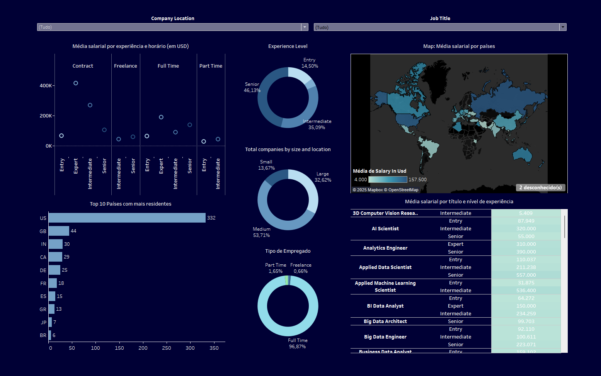
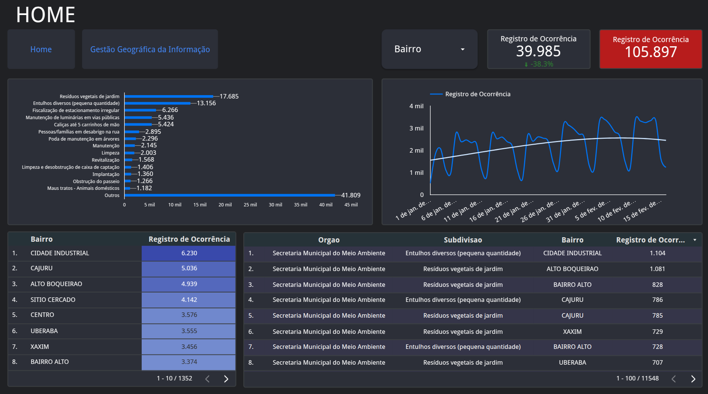
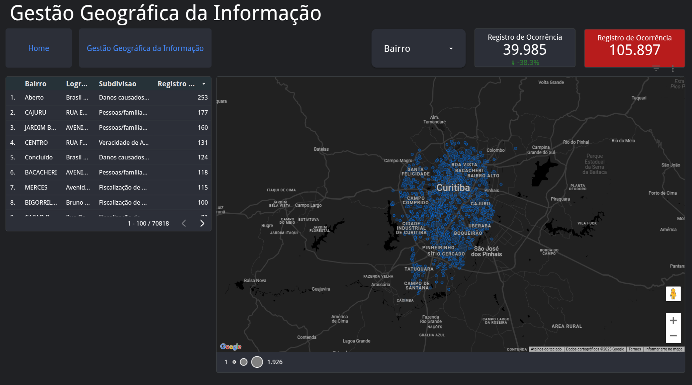
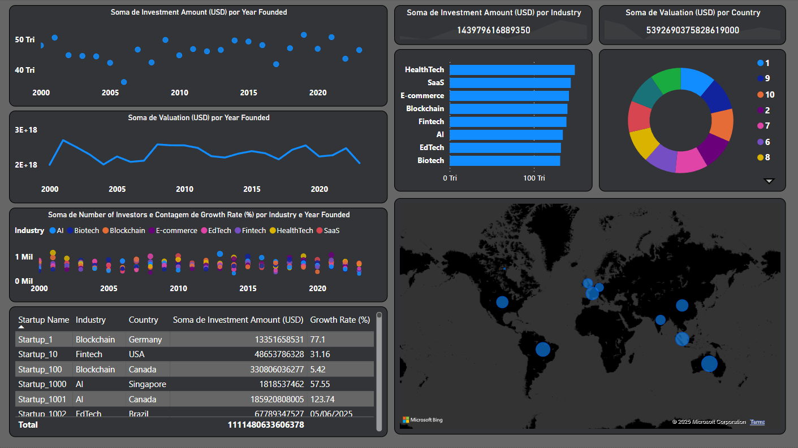

<!-- Banner no topo -->

# 🌐 Visualização de Dados

> Este estudo documenta a comparação entre quatro ferramentas de visualização de dados: **Power BI, Looker Studio, Tableau e Streamlit**. O objetivo é avaliar suas capacidades e identificar qual oferece a melhor experiência em termos de usabilidade, personalização, recursos e desempenho.
>
> Para tornar a análise mais abrangente, cada ferramenta foi testada com uma base de dados diferente, permitindo observar seu comportamento em distintos cenários. Os critérios de avaliação incluem facilidade de uso, flexibilidade, qualidade das visualizações e acessibilidade. Ao final, este estudo busca fornecer um panorama claro sobre as vantagens e limitações de cada ferramenta, auxiliando na escolha da opção mais adequada para diferentes necessidades.

---

## 1. Introdução

A análise e visualização de dados são fundamentais para a tomada de decisões em diversos setores. Este relatório compara quatro ferramentas amplamente utilizadas no mercado: **Power BI**, **Looker Studio**, **Tableau** e **Streamlit**. A avaliação foi realizada com base em critérios como usabilidade, personalização, recursos disponíveis, desempenho, custo-benefício e integração com outras plataformas. O objetivo é fornecer uma visão clara sobre as vantagens e limitações de cada plataforma, auxiliando na escolha da solução mais adequada para diferentes necessidades.

---

## 2. Metodologia

Para garantir uma análise abrangente, cada ferramenta foi testada com um dataset específico, escolhido com base em suas características e aplicações típicas:

- **Tableau:** Dados sobre salários e empregos de desenvolvedores ao redor do mundo, testando a capacidade de lidar com grandes volumes de dados e criar visualizações detalhadas.
- **Google Looker Studio:** Dados de mobilidade urbana em Curitiba, fornecidos pelas secretarias municipais, explorando a integração com fontes de dados externas e a colaboração em tempo real.
- **Power BI:** Estatísticas sobre crescimento e investimento de startups globais, ideal para avaliar a criação de dashboards interativos e a integração com ferramentas Microsoft.
- **Streamlit:** Dados sobre a população estadual brasileira nos últimos anos, utilizado para avaliar a flexibilidade e personalização da ferramenta em aplicações interativas.

### Abordagem de Testes
- **Funcionalidades:** Exploração das ferramentas disponíveis em cada plataforma.
- **Documentação:** Consulta às documentações oficiais e materiais de suporte.
- **Testes Práticos:** Criação de dashboards e visualizações para validar a usabilidade e desempenho.
- **Benchmarks:** Medição de tempo de carregamento de dados, tempo de renderização de gráficos e desempenho com grandes volumes de dados.

### Critérios de Avaliação
Os critérios utilizados para comparar as ferramentas foram:

| **Critério**                  | **Descrição**                                                                 |
|-------------------------------|-------------------------------------------------------------------------------|
| Facilidade de uso             | Interface intuitiva e curva de aprendizado.                                   |
| Personalização                | Flexibilidade na customização de dashboards e gráficos.                       |
| Integração de dados           | Capacidade de conectar-se a múltiplas fontes de dados.                        |
| Variedade de gráficos         | Opções disponíveis para visualização de dados.                                |
| Desempenho                    | Eficiência no processamento de grandes volumes de dados.                      |
| Custo-benefício               | Relação entre funcionalidades e custo de utilização.                          |
| Experiência do usuário        | Qualidade do suporte técnico, recursos de treinamento e comunidade.           |
| Integração com outras ferramentas | Compatibilidade com CRMs, ERPs e outras plataformas.                      |

---

## 3. Resultados e Análise

### 3.1 Tableau

   <strong>Tableau</strong>
    
  
Testei o Tableau com uma base de dados sobre salários e empregos de desenvolvedores ao redor do mundo. A importação do dataset foi rápida e fácil, e a criação de gráficos também ocorreu sem dificuldades. No entanto, ao tentar personalizar os dados, percebi que a plataforma não é tão intuitiva quanto outras opções disponíveis.

  
O funcionamento do Tableau exige que cada gráfico seja criado separadamente antes de ser inserido no painel. Esse processo pode ser um pouco limitado, pois não há muita liberdade para posicionar os gráficos e incluir outros elementos além de títulos e filtros. A construção do dashboard foi o aspecto mais desafiador da experiência, sendo a ferramenta que menos ofereceu opções de customização entre as que testei. Ainda assim, quando o objetivo é criar gráficos de forma ágil e precisa, o Tableau apresenta um bom desempenho.

  

    <h3>Prós</h3>
    <ul>
      <li>Fácil de importar dados</li>
      <li>Boa variedade de gráficos</li>
      <li>Criação de gráficos rápida e precisa</li>
      <li>Bom desempenho na importação e geração de gráficos</li>
      <li>Integração com diversas fontes de dados</li>
      <li>Interface intuitiva para criação de gráficos</li>
      <li>Possibilidade de interatividade nos dashboards</li>
      <li>Suporte a grandes volumes de dados</li>
      <li>Atualização automática de dados conectados</li>
    </ul>
  

  

    <h3>Contras</h3>
    <ul>
      <li>Poucas opções de personalização</li>
      <li>Difícil posicionar gráficos no dashboard</li>
      <li>Construção de painéis é complicada e limitada</li>
      <li>Algumas funções só estão na versão paga</li>
      <li>Pode consumir muitos recursos em dados grandes</li>
      <li>Licenciamento pode ser caro</li>
      <li>Exportação de relatórios pode ser limitada</li>
      <li>Utilizei em teste gratuito</li>
    </ul>
  

---

**Dataset:** [Salários de Desenvolvedores pelo Mundo](https://www.kaggle.com/datasets/samithsachidanandan/the-global-ai-ml-data-science-salary-for-2025)

---

### 3.2 Google Looker Studio

  
  <strong>Looker Studio</strong>
    
  
O Looker Studio foi testado com uma base de dados de mobilidade urbana em Curitiba, fornecida pelas secretarias municipais. A plataforma mostrou-se eficiente na integração com fontes de dados externas e na colaboração em tempo real. No entanto, a curva de aprendizado inicial foi um pouco desafiadora, especialmente na configuração de filtros e na personalização de gráficos.

  
Uma das vantagens do Looker Studio é a sua integração com o ecossistema Google, permitindo conexão direta com Google Sheets e BigQuery. Apesar disso, a plataforma apresentou algumas limitações, como a dificuldade em reconhecer campos geográficos e a dependência de conectores de terceiros para algumas funcionalidades.

  

    <h3>Prós</h3>
    <ul>
      <li>Variedade de Gráficos</li>
      <li>Customização de Estilos</li>
      <li>Desempenho Satisfatório</li>
      <li>Integração com Produtos Google</li>
      <li>Ferramenta Gratuita</li>
      <li>Colaboração em Tempo Real</li>
      <li>Conexão Direta com Google Sheets e BigQuery</li>
      <li>Publicação e Compartilhamento Simples</li>
    </ul>
  

  

    <h3>Contras</h3>
    <ul>
      <li>Curva de Aprendizado</li>
      <li>Configuração de Filtros</li>
      <li>Reconhecimento de Campos Geográficos</li>
      <li>Dependência de Conectores de Terceiros</li>
      <li>Problemas Ocasionalmente Relatados</li>
      <li>Menos Recursos Avançados</li>
      <li>Interface Pouco Intuitiva</li>
      <li>Pouca Flexibilidade na Modelagem de Dados</li>
    </ul>
  

---

**Dataset:** [Mobilidade Urbana em Curitiba](https://dadosabertos.curitiba.pr.gov.br/conjuntodado/detalhe?chave=0d5a7b06-3940-4be9-876e-bc8f23e96530)

---

### 3.3 Power BI

  
  <strong>Power BI</strong>
    
  
O Power BI foi testado com uma base de dados sobre crescimento e investimento de startups globais. A ferramenta mostrou-se poderosa e intuitiva, com uma interface bem organizada e uma ampla gama de funcionalidades. A personalização dos dashboards foi um ponto positivo, permitindo a importação de imagens de fundo e a aplicação de filtros avançados.

  
O Power BI também se destacou pela sua integração com outras ferramentas da Microsoft, como Excel e PowerPoint, e pela capacidade de lidar com grandes volumes de dados. Apesar de algumas limitações na versão web, a ferramenta mostrou-se eficiente e completa, sendo uma excelente opção para empresas e profissionais que buscam uma solução robusta para visualização de dados.

  

    <h3>Pros</h3>
    <ul>
      <li>Fácil de usar</li>
      <li>Versão web e aplicativo para desktop</li>
      <li>Leve e eficiente</li>
      <li>Compatível com outras ferramentas da Microsoft (Excel, PowerPoint)</li>
      <li>Grande variedade de funcionalidades</li>
      <li>Ampla gama de customizações para gráficos</li>
      <li>Interface intuitiva</li>
      <li>Marketplace de visuais e filtros personalizados</li>
      <li>Layouts predefinidos</li>
      <li>Fácil importação de dados</li>
      <li>Transformação de relatórios em slides</li>
      <li>Automação de atualizações de dados</li>
      <li>Conexão com diversas fontes de dados</li>
      <li>Análise de dados em tempo real</li>
      <li>Recursos de Inteligência Artificial e Machine Learning</li>
      <li>Publicação e compartilhamento de relatórios</li>
      <li>Modo offline</li>
      <li>Filtros avançados e segmentações</li>
      <li>Suporte a scripts Python e R</li>
      <li>Exportação para PDF, Excel, PowerPoint e outros formatos</li>
      <li>Visualização geoespacial com mapas</li>
    </ul>
  

  

    <h3>Contras</h3>
    <ul>
      <li>Compatibilidade limitada com sistemas como macOS e Linux.</li>
      <li>Necessidade de uma conta Microsoft autenticada com acesso ao Office.</li>
      <li>Limitações no tamanho dos conjuntos de dados, especialmente na versão gratuita.</li>
      <li>Dependência de uma conexão estável com a internet para recursos baseados na nuvem.</li>
      <li>Possíveis problemas de desempenho ao lidar com grandes volumes de dados ou relatórios complexos.</li>
      <li>Necessidade de configuração adicional para garantir a segurança de dados sensíveis.</li>
      <li>Integração limitada com algumas fontes de dados não Microsoft.</li>
      <li>Atualizações frequentes podem exigir adaptações constantes por parte dos usuários.</li>
    </ul>
  

---

**Dataset:** [Índice de Investimento e Crescimento Startups Globais](https://www.kaggle.com/datasets/adilshamim8/startup-growth-and-investment-data/data)

---

### 3.4 Streamlit

  <strong> Streamlit</strong>
    
  
Testei o Streamlit utilizando uma base de dados sobre a população estadual brasileira nos últimos anos. A base era bem completa, o que permitiu explorar diversas funcionalidades da plataforma. No início, tive dificuldades para rodar o framework devido a problemas de configuração de ambiente, mas, após resolver essas questões, consegui começar o desenvolvimento.

  
Criar dashboards no Streamlit foi relativamente fácil para mim, pois já tenho familiaridade com programação. No entanto, para quem não tem experiência em Python, pode ser mais desafiador. A documentação do Streamlit, no entanto, é bem completa e oferece diversos exemplos para quem está começando. Além disso, a possibilidade de personalizar as visualizações com código Python foi uma vantagem significativa.

  
Uma das grandes vantagens do Streamlit é a flexibilidade que ele oferece ao trabalhar com dados em tempo real, uma vez que ele permite atualizações dinâmicas nas visualizações. No geral, o Streamlit foi uma ferramenta interessante, embora eu tenha notado que, devido à necessidade de habilidades de programação, ele não seja o mais acessível para iniciantes.

  

    <h3>Prós</h3>
    <ul>
      <li>Flexibilidade para personalizar com Python</li>
      <li>Permite a atualização em tempo real</li>
      <li>Ótima documentação</li>
      <li>Baseada em Python, com boa integração com bibliotecas populares</li>
      <li>Simples para quem conhece Python</li>
      <li>Ideal para desenvolvedores que buscam criar dashboards dinâmicos</li>
      <li>Comunidade ativa e crescente</li>
      <li>Possibilidade de utilizar scripts em Python diretamente</li>
      <li>Fácil implantação com integração ao GitHub</li>
    </ul>
  

  

    <h3>Contras</h3>
    <ul>
      <li>Necessário conhecimento de programação</li>
      <li>Curva de aprendizado alta para iniciantes</li>
      <li>Menos recursos visuais em comparação com outras ferramentas</li>
      <li>Não possui tantas opções de gráficos prontos</li>
      <li>Requer configuração do ambiente Python</li>
      <li>Requer servidor para visualizações dinâmicas em grande escala</li>
      <li>Menos intuitivo para quem não tem experiência em código</li>
    </ul>
  

---

**Dataset:** [População Estadual Brasileira no Kaggle](https://github.com/DamiaoArth/DataScience/blob/main/Estudos%20Te%C3%B3ricos/Pesquisa%20sobre%20Plataformas%20de%20Data%20Analytics/data/br-population-2015-2024.csv)

---

## 4. Conclusão Geral

A tabela abaixo resume as recomendações para diferentes perfis de usuário:

| **Perfil de Usuário**           | **Ferramenta Recomendada**       | **Justificativa**                                                                 |
|---------------------------------|----------------------------------|-----------------------------------------------------------------------------------|
| Empresas                        | Power BI                        | Interface intuitiva, integração com Microsoft e funcionalidades avançadas.        |
| Analistas Iniciantes            | Looker Studio                   | Gratuito, fácil de usar e integrado ao ecossistema Google.                        |
| Desenvolvedores                 | Streamlit                       | Alta personalização e suporte a bibliotecas Python.                               |
| Profissionais Avançados         | Tableau                         | Visualizações detalhadas e suporte a grandes volumes de dados.                    |

### Tendências Futuras
- **Power BI:** Continua a integrar recursos de IA e Machine Learning, além de melhorar a compatibilidade com sistemas não-Microsoft.
- **Looker Studio:** Foco em melhorar a usabilidade e expandir a integração com outras plataformas.
- **Tableau:** Investimento em ferramentas de colaboração e análise preditiva.
- **Streamlit:** Crescente adoção em projetos de ciência de dados e aplicações customizadas.

---

## Anexos

- **Base de Dados Utilizada:**
  - Estatísticas sobre crescimento e investimento de startups globais ([Power BI](https://www.kaggle.com/datasets/adilshamim8/startup-growth-and-investment-data/data)).
  - Dados de mobilidade urbana em Curitiba ([Looker Studio](https://dadosabertos.curitiba.pr.gov.br/conjuntodado/detalhe?chave=0d5a7b06-3940-4be9-876e-bc8f23e96530)).
  - Salários e empregos de desenvolvedores ao redor do mundo ([Tableau](https://www.kaggle.com/datasets/samithsachidanandan/the-global-ai-ml-data-science-salary-for-2025)).
  - População estadual brasileira nos últimos anos ([Streamlit](https://github.com/DamiaoArth/DataScience/blob/main/Estudos%20Te%C3%B3ricos/Pesquisa%20sobre%20Plataformas%20de%20Data%20Analytics/data/br-population-2015-2024.csv)).

- **Referências:**
  - Documentação oficial das ferramentas ([Power BI](https://learn.microsoft.com/pt-br/power-bi/), [Looker Studio](https://cloud.google.com/looker/docs/looker-core?hl=pt-br), [Tableau](https://www.tableau.com/pt-br/support/help), [Streamlit](https://docs.streamlit.io/)).
  - Tutoriais e vídeos de referência disponíveis online.

---

Este relatório foi elaborado com o objetivo de fornecer uma análise detalhada e imparcial das ferramentas de visualização de dados, auxiliando na escolha da solução mais adequada para diferentes cenários e necessidades.